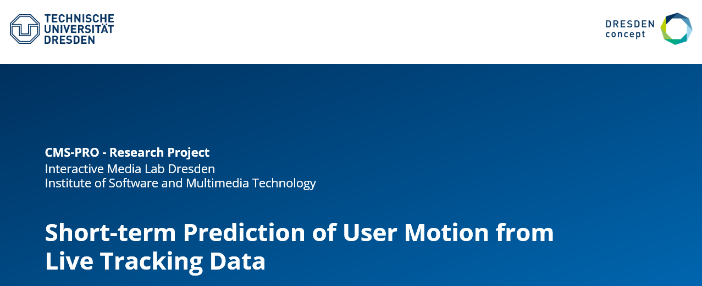

# Short-term Prediction of User Motion from Live Tracking Data

Live human tracking via the Kinect has seen an increasing rise in usage across various domains. However, there exists a delay in terms of when the Kinect tracks human motion and when such data is available to us for use in real-time, hampering user experience and hindering analysis. This research project aims to address the aforementioned issue by investigating the potential to remedy this problem using human motion prediction. Specifically, it explores the capacity to integrate 3D human motion prediction models with livetracked data in the short term to reduce the Kinect’s latency between tracking and processing.

Starting with an exploration of the literature and the related work, various 3D human motion prediction models were evaluated in terms of their latency and accuracy. This included both autoregressive and non-autoregressive models. The results were then analyzed to make an informed selection of a top-performing model suitable for use in real-time applications. 

The STS GCN model, which is a graph convolutional network, stood out amongst all the evaluated models, having the quickest inference time and competitive accuracy. Additionally, a diffusion-based model was evaluated due to its ability for noise correction in data.
